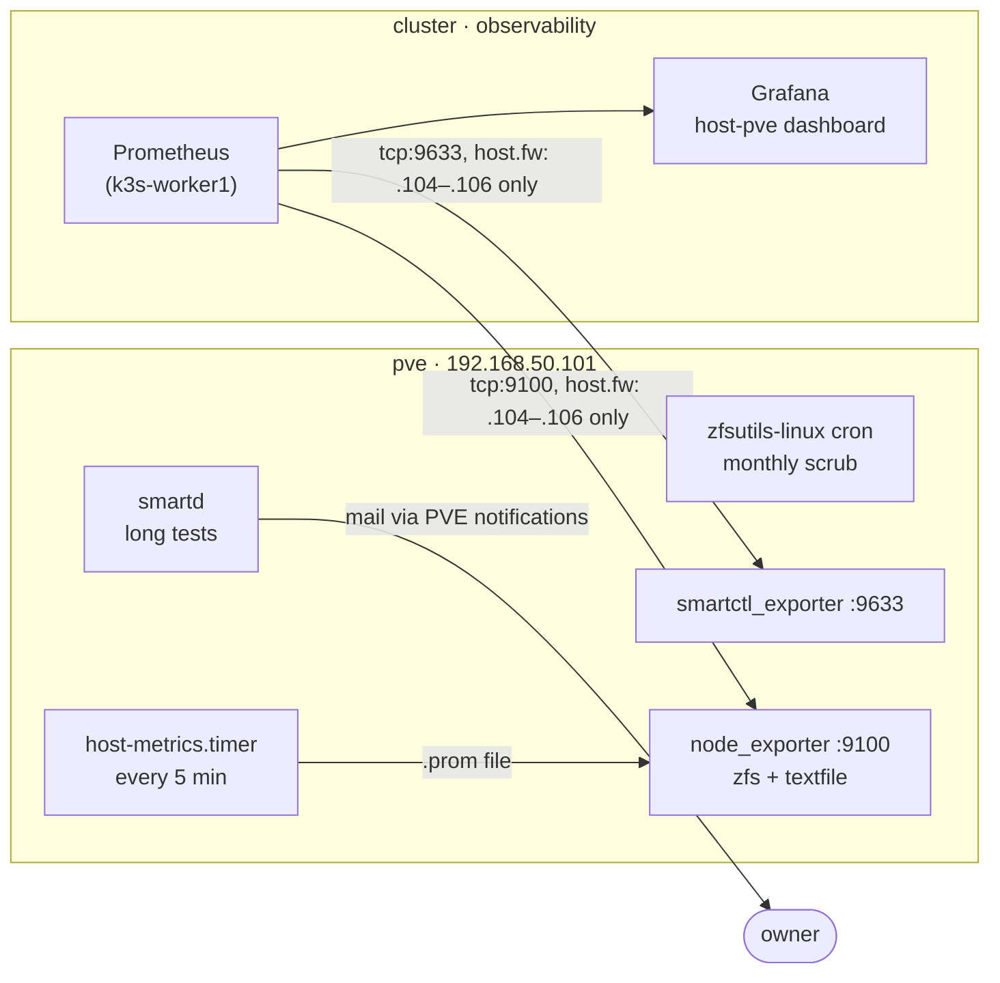

# Host Monitoring — SMART tests, scrubs and metrics for the Proxmox host

The observability stack runs inside the cluster, and its node-exporter
DaemonSet covers the three k3s **nodes**. The Proxmox host (`pve`,
`192.168.50.101`) and every disk in it are covered here instead: two
scheduled **jobs** on the host (SMART long tests and scrubs), three **metric
sources** on the host, and the **scrape config, alert rules and dashboard**
in the cluster.

These goals come from the TrueNAS guest that was designed and never built
([`archive/TRUENAS.md`](archive/TRUENAS.md)): the appliance would have run
SMART tests and scrubs and shown a health UI. With `sas-pool` native on the
host ([`SAS-STORAGE.md`](SAS-STORAGE.md)), each goal has a home of its own.



## The goals

| # | Goal | Mechanism | Runs on |
|---|---|---|---|
| **G1** | Scheduled **SMART long tests** on the SAS and SATA SSDs | `smartd` (`/etc/smartd.conf`) | host |
| **G2** | Scheduled **scrubs** of every pool | Proxmox's `/etc/cron.d/zfsutils-linux` | host |
| **G3** | **Pool state**, ARC, dataset I/O, host CPU/memory/disk as metrics | `prometheus-node-exporter` (Debian), `zfs` collector | host |
| **G4** | **Per-drive SMART** as metrics | `smartctl_exporter` (upstream binary) | host |
| **G5** | **Pool capacity and health, scrub age, sanoid snapshot age, `local-lvm` thin pool** as metrics | `host-metrics` → node-exporter's textfile collector | host |
| **G6** | *Folded into G5* — see below | — | — |
| **G7** | **Alert rules + dashboard** over G3–G5 | `kubernetes/apps/observability/host-monitoring/` | cluster |

G1 and G2 are *jobs*, not dashboards. They keep running when the cluster is
off, which is often.

**G6 is folded into G5.** The thin pool and per-storage capacity come from
`host-metrics` on the host, not from `prometheus-pve-exporter` in the
cluster. The exporter needs a Proxmox API token in-cluster, the one kind of
credential the [scope split](GITOPS.md#scope-flux-manages-the-cluster-not-the-hypervisor)
keeps out. It also doesn't report the thin pool's `Meta%`, so the script
was needed anyway. What that gives up is per-guest metrics from the Proxmox
API; every guest that matters runs its own node-exporter. See `GITOPS.md` →
*Explicitly rejected*.

## G1 — SMART long tests

Devices are addressed by `by-id` (kernel names move between boots — see
[`HARDWARE.md`](HARDWARE.md)), each pool on its own day so two don't
self-test at once:

| Pool | Schedule | Devices |
|---|---|---|
| `sas-pool` | Saturdays 03:00 | the 3 SAS SSDs |
| `archive-pool` | Sundays 03:00 (live MinIO + Postgres data) | the 3 SATA SSDs |
| `llm-pool` | Fridays 03:00 (no redundancy) | 1 SATA SSD |

Temperature warn/crit at 45°C/55°C on every line. The `archive-pool` SATA
drives have degraded SMART logs through the PERC (no self-test or error log
on most of them), so they are watched through temperature and attributes as
well as the pass/fail bit. `smartd` mails through PVE's own notification
system (`proxmox-mail-forward`), not plain postfix, which doesn't deliver
from this host. This is the one alert path that doesn't depend on the
cluster. History: [`archive/HOST-MONITORING-SETUP.md`](archive/HOST-MONITORING-SETUP.md).

## G2 — scrubs

Proxmox's `/etc/cron.d/zfsutils-linux` scrubs **every imported pool** at
00:24 on the second Sunday of each month (and TRIMs on the first). That is
the only scrub mechanism. Don't add `zfs-scrub-monthly@<pool>.timer` on top:
two scrubs of the same pool is wasted I/O, not twice the safety.

A pool created after the month's scrub has no completed scrub until the next
one, and `HostZpoolScrubStale` fires for it. Scrub it by hand once
(`zpool scrub <pool>`).

## G3–G5 — on the host

| Piece | What | Where |
|---|---|---|
| `prometheus-node-exporter` | Debian's package, defaults. Serves `:9100`; its `zfs` collector gives `node_zfs_zpool_state`, ARC and per-dataset I/O; its textfile collector reads `/var/lib/prometheus/node-exporter/*.prom` | apt |
| `smartctl_exporter` v0.14.0 | Runs `smartctl` itself on a timer and serves the cached result on `:9633`, so a scrape never touches a disk. Debian doesn't package it | `/usr/local/bin/`, unit [`scripts/host-monitoring/smartctl-exporter.service`](scripts/host-monitoring/smartctl-exporter.service) |
| `host-metrics` | Writes `host-metrics.prom` every 5 minutes, atomically | `/usr/local/sbin/`, [`scripts/host-monitoring/`](scripts/host-monitoring/) (script, `.service`, `.timer`) |

What `host-metrics` exports (all labelled `instance="pve"` once scraped):

| Metric | From | Notes |
|---|---|---|
| `host_zpool_{size,allocated,free}_bytes`, `host_zpool_fragmentation_percent` | `zpool list -Hp` | per `pool` |
| `host_zpool_health{pool,health}` | `zpool list` | always 1; alert on `health!="ONLINE"` |
| `host_zpool_scrub_end_timestamp_seconds` | `scan:` line of `zpool status` | **0** when there is no completed scrub (none yet, canceled, or the last scan was a resilver); absent while a scrub runs |
| `host_zpool_scrub_errors`, `host_zpool_scrub_in_progress` | same | |
| `host_zfs_autosnap_newest_timestamp_seconds`, `host_zfs_autosnap_count` | `zfs list -t snapshot` | per `dataset`; **`autosnap_*` only**, so a manual snapshot can't hide a stopped sanoid |
| `host_lvm_thinpool_{data,metadata}_percent` | `lvs pve/data` | Data% and Meta%; either at 100% breaks every guest disk in the pool |
| `host_lvm_thinpool_{size,virtual}_bytes` | `lvs` | virtual = sum of the thin volumes' sizes; above size means overcommitted |
| `host_lvm_vg_free_bytes` | `vgs pve` | room to grow the pool |
| `host_metrics_collector_success{collector}`, `host_metrics_last_run_timestamp_seconds` | the script | one section failing doesn't blank the others |

> ⚠️ **The PERC exposes every disk twice.** `smartctl --scan` finds each
> drive as `sdX` *and* through the controller (`bus_2_megaraid_N`,
> `bus_2_sat+megaraid_N`). The exporter runs with
> `--smartctl.device-exclude=^bus_` to keep only `sdX`, the view `smartd` and
> ZFS use. Without it every drive, and every SMART alert, appears twice.

> ⚠️ **`device="sdX"` labels move between boots**, as kernel names do. The
> rules and dashboard join `smartctl_device` to name each drive by
> `serial_number`, which is what `HARDWARE.md` lists.

> ⚠️ **This ZFS version has no per-pool I/O kstat**, so `node_zfs_zpool_nread`
> doesn't exist. Pool I/O on the dashboard is the sum of the per-dataset
> counters (`node_zfs_zpool_dataset_nread`): logical I/O, before parity and
> mirroring.

> ⚠️ **`smartctl_exporter` doesn't update itself.** It's a release binary,
> not a package, and Renovate doesn't see the host. Upgrade by hand with the
> install steps below.

### Installing it

On the workstation:

```bash
scp -3 dev:homelab/scripts/host-monitoring/host-metrics \
  proxmox-host:/usr/local/sbin/
scp -3 'dev:homelab/scripts/host-monitoring/*.service' \
  proxmox-host:/etc/systemd/system/
scp -3 dev:homelab/scripts/host-monitoring/host-metrics.timer \
  proxmox-host:/etc/systemd/system/
```

On the host. `--no-install-recommends` leaves out Debian's `smartmon`
collector, which would duplicate `smartctl_exporter`:

```bash
apt update
apt install --no-install-recommends prometheus-node-exporter
cd /tmp
V=0.14.0
U=https://github.com/prometheus-community/smartctl_exporter
F=smartctl_exporter-$V.linux-amd64
curl -fLO $U/releases/download/v$V/$F.tar.gz
curl -fLO $U/releases/download/v$V/sha256sums.txt
sha256sum -c --ignore-missing sha256sums.txt
tar xzf $F.tar.gz
install -m755 $F/smartctl_exporter /usr/local/bin/
chmod 755 /usr/local/sbin/host-metrics
systemctl daemon-reload
systemctl enable --now smartctl-exporter.service
systemctl enable --now host-metrics.timer
```

### Firewall

`host.fw` is default-drop. Only the three k3s nodes may scrape, because pod
egress to the LAN is masqueraded to the node's address. A routed tailnet
device arrives as `192.168.50.102` and is refused (same reasoning as VM
105's `ufw`, [`GPU-VM.md`](GPU-VM.md)). In `/etc/pve/nodes/pve/host.fw`:

```ini
[RULES]
IN ACCEPT -source 192.168.50.104-192.168.50.106 -p tcp -dport 9100 -log nolog # node-exporter
IN ACCEPT -source 192.168.50.104-192.168.50.106 -p tcp -dport 9633 -log nolog # smartctl-exporter
```

Reload with `pve-firewall compile >/dev/null && pve-firewall restart`.

## G7 — in the cluster

`kubernetes/apps/observability/host-monitoring/`: two `ScrapeConfig`s
(`host-node` for `:9100`, `host-smartctl` for `:9633`), a `PrometheusRule`
and the `host-pve` Grafana dashboard. There are two scrape configs because
both targets carry `instance="pve"`, and two targets with identical labels in
one job would collide on `up`.

| Alert | Fires when | Severity |
|---|---|---|
| `HostZpoolUnhealthy` | any pool not `ONLINE`, 5m | critical |
| `HostZpoolScrubStale` | no completed scrub in 35 days, 1h | warning |
| `HostZpoolScrubErrors` | last scrub found errors | critical |
| `HostZpoolFilling` | pool > 80% allocated, 30m | warning |
| `HostSnapshotStale` | newest sanoid snapshot of a dataset > 2h old, 30m (covers a host boot) | warning |
| `HostThinPoolDataHigh` / `Critical` | thin pool Data% > 80 (15m) / > 90 (5m) | warning / critical |
| `HostThinPoolMetadataHigh` | thin pool Meta% > 80, 15m | warning |
| `HostDriveSmartFailed` | `smartctl_device_smart_status == 0` | critical |
| `HostDriveSasDefects` | SAS grown defects or uncorrected read/write errors > 0 | warning |
| `HostDriveAtaMediaErrors` | SATA attribute 5, 197 or 198 raw > 0 (these drives report 5 and 198) | warning |
| `HostDriveHot` | drive > 55°C, 10m | warning |
| `HostExporterDown` | either scrape target down, 15m | warning |
| `HostMetricsStale` | `host-metrics` output > 15m old, or a section failing | warning |
| `HostRootFilesystemLow` | host `/` < 10% free, 30m | warning |

`HostRootFilesystemLow` is needed because kube-prometheus-stack's node alerts
select only the cluster's own node-exporter job. Every media-error counter
the SMART rules read is 0 on every drive, so any non-zero value is new.

## Checking it

| Check | Healthy |
|---|---|
| On the host: `systemctl is-active smartctl-exporter host-metrics.timer prometheus-node-exporter` | `active` ×3 |
| On the host: `cat /var/lib/prometheus/node-exporter/host-metrics.prom` | every `host_metrics_collector_success` 1; three pools `ONLINE`; four datasets with a recent `autosnap` time |
| On the host: `curl -s localhost:9633/metrics \| grep -c '^smartctl_device{'` | `9`: 3 SAS + 5 SATA + the BOSS virtual disk, and no `bus_` devices |
| Prometheus: `up{job=~"scrapeConfig/observability/host-.*"}` | two series, both 1 |
| Prometheus: `count(host_zpool_health{instance="pve"})` | 3 |
| Prometheus: `ALERTS{alertname=~"Host.*"}` | empty |

A failed scrape from the cluster that works from the host itself means
`host.fw`.

## What this does not cover

- **The BOSS-S2 boot mirror stays invisible.** The OS can't see its member
  disks; `smartctl` on `sda` reads the virtual disk. A failed half surfaces
  only in iDRAC or the BOSS CLI.
- **The monitor sits on what it monitors.** Prometheus runs on `k3s-worker1`,
  a VM on this host. Host down means monitoring down, and `HostExporterDown`
  goes with it. Only `smartd`'s mail escapes this.
- **The cluster is frequently powered off** (`README.md` operating
  assumptions). A drive degrading overnight with k3s down is seen at the next
  boot, not at 03:00.
- **Alertmanager is on the chart's `null` receiver** (`GITOPS.md` →
  kube-prometheus-stack). Every alert here is visible in Prometheus and
  Grafana, and pushed nowhere.

## Series budget

The host adds about 4,600 series (node-exporter ~3,960, smartctl_exporter
~640) to Prometheus' ~62,000, about 7%. `retention: 15d` with
`retentionSize: 4GiB` (`GITOPS.md` → kube-prometheus-stack) absorbs that;
check `k3s-worker1`'s free disk, not just the series count, before adding
more.

## Related

- [`archive/HOST-MONITORING-SETUP.md`](archive/HOST-MONITORING-SETUP.md) — how
  G1–G7 were built: the DEVICESCAN trap, the mail-delivery incident, the G6
  decision
- [`archive/TRUENAS.md`](archive/TRUENAS.md) — the unbuilt appliance these
  goals came from
- [`SAS-STORAGE.md`](SAS-STORAGE.md) — `sas-pool`, and the host firewall
- [`HARDWARE.md`](HARDWARE.md) — disks by serial, SMART baselines, the BOSS-S2
  blind spot
- [`SANOID.md`](SANOID.md) — the snapshots `HostSnapshotStale` watches
